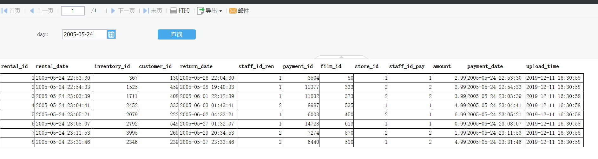
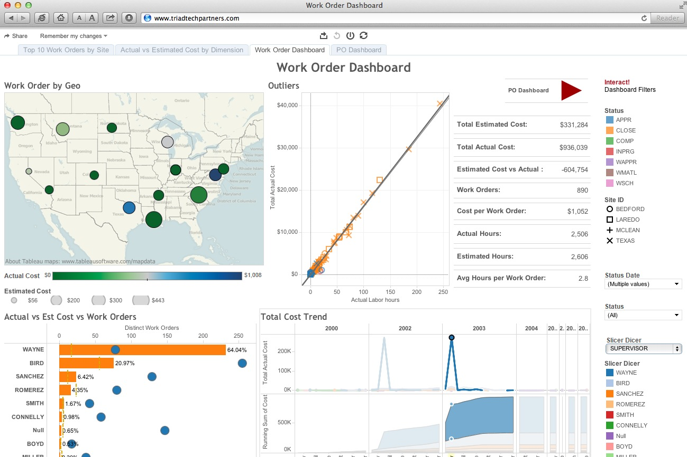

# 运行测试

Sakila 是Mysql的样例数据库，音响的电影租赁数据。

所用文件在 demo 文件夹下

## Sakila Sample Database

- 说明文档：https://dev.mysql.com/doc/sakila/en/
- 下载地址：
    - https://downloads.mysql.com/docs/sakila-db.zip
    - /demo/sakila-db 文件夹下

## 说明
表格
- 电影维表：dim_film
- 地址维表：dim_address
- 交易日志表：mid_rental

## 演示
以 构建 film 的维表为例
### Python
文件位置：demo/code/dim_film.py
```
# 定位到工作根目录
import sys
from os.path import abspath, join, dirname
sys.path.insert(0, join(abspath(dirname(__file__)), '../../'))

# 载入工具包和自定义工具包
import numpy as np
import pandas as pd

from package.env import *
from package.source.sql_connect import *

# 切换开发环境
dev()
# 获取连接
conn, engine = mysql_on("sakila")

# 获取数据
df_film = pd.read_sql("select * from film", engine).drop(['last_update'],axis=1)
df_film_category = pd.read_sql("select * from film_category", engine).drop(['last_update'],axis=1)
df_category = pd.read_sql("select * from category", engine).drop(['last_update'],axis=1).rename(columns={"name":"category_name"})
df_language = pd.read_sql("select * from language", engine).drop(['last_update'],axis=1).rename(columns={"name":"language_name"})

# 
df_data = df_film.merge(df_film_category, how="left", on="film_id")
df_data_2 = df_data.merge(df_category, how="left", on="category_id")
df_data_3 = df_data_2.merge(df_language, how="left", on="language_id")

# 载入数据
conn, engine = mysql_on("test")
mysql_upload(df_data_3,"dim_film",conn,engine,type="r")

# 关闭数据连接
mysql_close(conn, engine)

```

### Azkaban
略

### FineReport
自动构造日报、周报、月报

<https://raw.githubusercontent.com/zhenghao0379/blog/master/pic/fr_demo1.png>


### PowerBI or Tableau
由于已经建立完善的数据仓库，可以高效快速的构建BI

<https://raw.githubusercontent.com/zhenghao0379/blog/master/pic/tableau_demo1.png>
